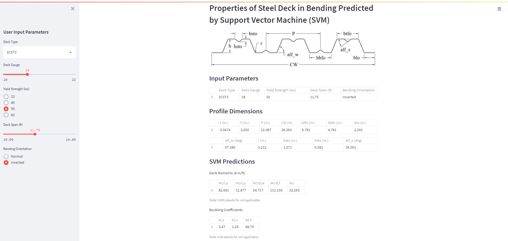

# Web application to predict deck properties in bending by SVR models

This Streamlit web application predicts the following properties of steel deck in bending by Support Vector Machine regression (SVR) models: 
- plate buckling coefficient of stiffened flanges; 
- plate buckling coefficient of unstiffened flanges; 
- plate buckling coefficient for distortional buckling of deck flanges with a longitudinal stiffener; 
- local elastic buckling moment of stiffened flanges; 
- local elastic buckling moment of unstiffened flanges; 
- distortional elastic buckling moment of a web-edge flange junction; 
- distortional elastic buckling moment of a flange-stiffener junction; 
- ultimate moment.

The application is based on the models described in the following paper: Degtyarev, V.V. (2022). "Exploring machine learning for predicting elastic buckling and ultimate moments of steel decks in bending." Proceedings of the Annual Stability Conference. Structural Stability Research Council (SSRC), Denver, Colorado. (in press).

## Instructions on how to use the application

1. Download the content of the repository to the local machine.
2. With Python installed, install the required packages listed in the 'requirements.txt' file.
3. Open command-line interface (cmd.exe).
4. Change to the directory on the local machine where the application was saved.
5. Type the following: streamlit run Steel_Deck_Streamlit.py
6. The application opens in a web browser tab.
7. Use sliders and radio buttons to change beam parameters.

